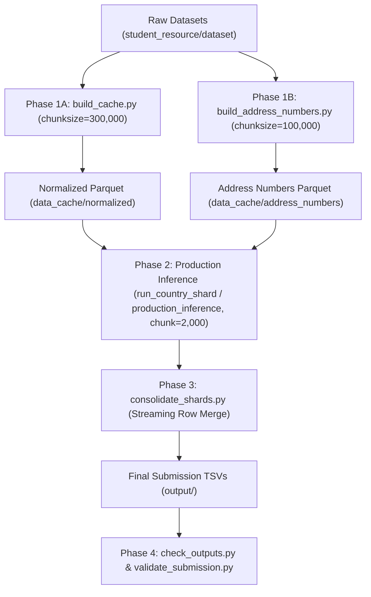

# Business Entity Resolution Pipeline

High-performance, memory-bounded, streaming entity resolution pipeline for the **Amazon ML Challenge 2026**.

The solution implements the **FINAL-B-H2** configuration:
- **D3 Multi-Channel Blocking**: Exact normalized names, suffix-stripped names, token inverted indexes (name tokens $K=4$, address tokens $K=6$), and postal codes.
- **42 Pairwise Features**: 28 base text similarity / token overlap features + 14 structured address number agreement/contradiction features.
- **Model**: Balanced Logistic Regression with Standard Scaler (`B_frozen.npz`).
- **Two-Tier Decision Policy (B + H2)**:
  - **Rule B**: Predict candidate matches with decision score $z \ge 8.3$ ($p \ge 0.99975$).
  - **Rule H2 (Singleton Recovery)**: For entities with zero predictions at $z \ge 8.3$, select the top candidate if $z \ge 3.0$ and strict house number agreement holds with zero contradictions.

---

## Architecture & Chunking Strategy

Processing 5M+ row datasets on machines with limited RAM (~5GB–8GB) requires strict streaming and chunking:
1. **Raw TSV Streaming**: Raw dataset files are ingested in streaming chunks and written incrementally to compressed Parquet files.
2. **Multiprocessing Extraction**: Address numbers are extracted using chunked multiprocessing pools.
3. **Country-Level Partitioning**: All blocking keys include the country code. Entities never match across countries, enabling independent country sharding (`FR`, `IN`, `US`).
4. **S1 Entity Chunking**: Inside each country, Source 1 entities are processed in fixed-size batches (default: 2,000 entities per chunk). For each chunk, candidates are generated, featurized, scored, and decided in memory, then immediately appended to disk. Peak RAM remains strictly bounded.
5. **Deterministic Row-Preserving Merge**: Each shard records original `test_source1` row indices. The consolidation step performs a $k$-way merge to restore the exact original row sequence.

---

## Directory Structure

```text
├── code/
│   └── business_entity_resolution/
│       ├── src/
│       │   ├── address_numbers.py              # Address number extraction regex logic
│       │   ├── blocking.py                     # Inverted index & token blocking
│       │   ├── build_address_numbers.py        # Chunked address number cache builder
│       │   ├── build_cache.py                  # Chunked TSV -> Parquet normalizer
│       │   ├── build_number_features.py        # 14 address number pairwise features
│       │   ├── build_pairwise_features.py      # 28 base text & token similarity features
│       │   ├── check_outputs.py                # Output validation & integrity checker
│       │   ├── consolidate_shards.py           # Shard consolidation & k-way row merge
│       │   ├── generate_dev_candidates.py      # Candidate generation module
│       │   ├── normalization.py                # Unicode transliteration & text cleaning
│       │   ├── production_inference.py         # Sequential streaming production inference
│       │   ├── run_country_shard.py            # Country shard worker (FR / IN / US)
│       │   ├── run_shard_smoke.sh              # 1,000 S1 smoke test runner
│       │   └── train_evaluate_matcher.py       # Model training & evaluation
│       └── tests/
│           └── test_address_numbers.py         # Unit tests for address number parser
├── data_cache/
│   └── models/
│       └── B_frozen.npz                        # Pre-trained frozen scaler & model weights
├── output/                                     # Output candidate pairs & submission files
├── reports/                                    # Validation reports & evaluation logs
└── student_resource/
    ├── dataset/                                # TSV datasets (train/ and test/)
    └── utils/
        └── validate_submission.py              # Official format validator
```

---

## Prerequisites & Installation

### 1. Python Environment

Ensure Python 3.10+ is installed. Install required packages:

```bash
pip install numpy pandas pyarrow scikit-learn rapidfuzz psutil pytest
```

### 2. Dataset Setup

Place competition data into `student_resource/dataset/`:

```text
student_resource/dataset/
├── train/
│   ├── train_source1.tsv
│   ├── train_source2.tsv
│   ├── train_source3.tsv
│   └── train_ground_truth.tsv
└── test/
    ├── test_source1.tsv
    ├── test_source2.tsv
    └── test_source3.tsv
```

---

## Execution Guide in Chunking Order

Execute the following phases in sequence.



### Phase 1: Precompute & Normalize Caches (Streaming Chunks)

Both steps stream large TSV files in chunks so that full tables are never held in memory.

#### 1A. Normalize Source Files

Streams raw TSVs in chunks of 300,000 rows, normalizes entity names, addresses, and postal codes, and writes compressed Parquet files incrementally:

```bash
python code/business_entity_resolution/src/build_cache.py \
  --dataset-dir student_resource/dataset \
  --out-dir data_cache/normalized \
  --chunksize 300000
```

#### 1B. Extract Structured Address Numbers

Streams addresses in chunks of 100,000 rows using a multiprocessing pool to extract house, building, and unit numbers:

```bash
# Train set
python code/business_entity_resolution/src/build_address_numbers.py --prefix train

# Test set
python code/business_entity_resolution/src/build_address_numbers.py --prefix test
```

Outputs are saved under `data_cache/address_numbers/`.

---

### Phase 2: Production Inference (Chunked by Country & S1 Chunks)

You can run inference using **Option A (Country Sharding - Recommended)** or **Option B (Sequential Pipeline)**. Both options use the frozen model in `data_cache/models/B_frozen.npz`.

#### Option A: Country Sharded Execution (Recommended)

> [!TIP]
> **Pre-packaged Shard Kit**: If running shards on separate worker machines, download the pre-packaged bundle [`shard_kit.zip` (v1.0.0)](https://github.com/lokikun-glitch/Amazon-ML-Challenge/releases/download/v1.0.0/shard_kit.zip) from GitHub Releases. It includes the complete codebase, pinned dependencies, precomputed test caches, and frozen models ready to execute without running Phase 1.

Each country shard can be executed sequentially or in parallel on separate machines. Each worker loads only that country's S2/S3 index and processes S1 entities in chunks (default `--chunk 2000`):

```bash
# 1. France Shard
python code/business_entity_resolution/src/run_country_shard.py \
  --country FR \
  --chunk 2000 \
  --out-root output/shards

# 2. India Shard
python code/business_entity_resolution/src/run_country_shard.py \
  --country IN \
  --chunk 2000 \
  --out-root output/shards

# 3. United States Shard
python code/business_entity_resolution/src/run_country_shard.py \
  --country US \
  --chunk 2000 \
  --out-root output/shards
```

*Outputs produced per country:*
- `output/shards/<CODE>/candidate_pairs_<CODE>.tsv`
- `output/shards/<CODE>/matching_results_<CODE>.tsv`
- `output/shards/<CODE>/manifest_<CODE>.json` (contains SHA-256 hashes, runtime stats, and peak RSS)

#### Option B: Sequential Pipeline

Runs all countries sequentially in a single process, streaming chunks of 2,000 S1 records:

```bash
python code/business_entity_resolution/src/production_inference.py \
  --chunk 2000 \
  --out-dir output
```

---

### Phase 3: Consolidate Country Shards

*(Required if using Option A)*

Merges the country shard files in exact original `test_source1.tsv` row order via streaming $k$-way merge (`heapq.merge`):

```bash
python code/business_entity_resolution/src/consolidate_shards.py \
  --shard-root output/shards \
  --out-dir output \
  --shards FR,IN,US
```

*Generated final submission files:*
- `output/candidate_pairs.tsv`
- `output/matching_results.tsv`
- `output/consolidation_manifest.json`

---

### Phase 4: Validation & Integrity Checks

Verify submission validity, schemas, ID prefixes, and format requirements:

#### 4A. Run Pipeline Integrity Checks

```bash
python code/business_entity_resolution/src/check_outputs.py --dir output
```

#### 4B. Run Official Competition Validator

```bash
python student_resource/utils/validate_submission.py \
  --candidate-file output/candidate_pairs.tsv \
  --matching-file output/matching_results.tsv \
  --test-s1 student_resource/dataset/test/test_source1.tsv
```

---

## Smoke Testing (Fast Validation Run)

To verify the end-to-end pipeline on a deterministic sample of 1,000 S1 entities per country:

### On Linux / macOS / Git Bash:

```bash
sh code/business_entity_resolution/src/run_shard_smoke.sh
```

### On Windows PowerShell:

```powershell
$R = "output/shard_smoke"
foreach ($C in "FR", "IN", "US") {
    python code/business_entity_resolution/src/run_country_shard.py --country $C --smoke-per-country 1000 --out-root $R
}
python code/business_entity_resolution/src/consolidate_shards.py --smoke --shard-root $R --out-dir $R
python code/business_entity_resolution/src/check_outputs.py --smoke --dir $R
```

---

## Key Tuning & Performance Flags

| Parameter | Script | Default | Description |
|---|---|---|---|
| `--chunksize` | `build_cache.py` | `300000` | Number of raw TSV rows processed per normalization batch. Lower if system memory is under 4GB. |
| `--chunk` | `run_country_shard.py` / `production_inference.py` | `2000` | S1 entity batch size during candidate generation, featurization, and scoring. |
| `--smoke-per-country` | `run_country_shard.py` / `production_inference.py` | `0` | If $> 0$, takes an evenly spaced sample of $N$ entities per country for rapid validation. |
| `PYTHONHASHSEED` | Internal | `0` | Enforced automatically by `production_inference.py` for reproducible token frequency tie-breaking. |
